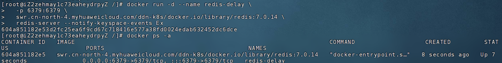

# Getting Started

本项目将介绍使用 Redis 的 Stream 实现延迟（Delay）功能。


# 开启 redis的key过期通过

注意：以下仅在Linux上安装的docker有效，windows的redis不支持 `notify-keyspace-events Ex`

## 手动安装redis的情况
[Redis开启键空间通知实现超时通知的步骤](https://segmentfault.com/a/1190000022823795)

修改配置文件redis.conf

打开该配置文件(位置取决于自己的安装位置)，找到Event notification部分。

将notify-keyspace-events Ex的注释打开或者添加该配置，其中E代表Keyevent，此种通知会返回key的名字，x代表超时事件。

如果notify-keyspace-events ""配置没有被注释的话要注释掉，否则不会生效。

保存后重启redis，一定要使用当前配置文件重启，例如src/redis-server redis.conf


总结而言，即打开 `notify-keyspace-events Ex` 配置，关闭 `notify-keyspace-events ""` 配置。保存之后重启redis服务


## docker内安装的redis

国内可用镜像：https://docker.aityp.com/

拉镜像：
```shell
docker pull swr.cn-north-4.myhuaweicloud.com/ddn-k8s/docker.io/library/redis:7.0.14
```

启动带有`notify-keyspace-events Ex` 配置新redis容器
```shell
docker run -d --name redis7014 \
  -p 6379:6379 \
  swr.cn-north-4.myhuaweicloud.com/ddn-k8s/docker.io/library/redis:7.0.14 \
  redis-server --requirepass root123 --notify-keyspace-events Ex
```




# 应用场景

## 笼统的应用场景

Redis Streams 实现延迟功能的应用场景有很多，特别是在分布式任务队列和事件驱动架构中。以下是几个常见的应用场景：

1. **定时任务调度**：
   Redis Streams 可以用来实现定时任务的调度系统。任务可以放入 Stream 中，设置延迟时间，消费者在延迟时间到达后处理任务。例如，你可以将任务按时间顺序插入 Stream，并根据任务的时间戳或其他标记来延迟执行。

2. **延迟队列**：
   在需要推迟某个任务执行的场景下，使用 Redis Streams 实现延迟队列是一种常见做法。任务在队列中被延迟一定时间后才会被消费者消费。比如在支付系统中，可能需要在一定时间后发送提醒通知，这时可以将提醒任务放入延迟队列。

3. **重试机制**：
   在任务失败时，可以使用 Redis Streams 实现带有延迟的重试机制。例如，某些任务如果执行失败，可以在一定时间后重新尝试。可以在 Stream 中放入失败任务，并在一定的延迟后将其再次处理。

4. **延迟消息通知**：
   在事件驱动架构中，Redis Streams 可以用于延迟消息通知。比如在用户注册成功后，系统可能需要延迟发送欢迎邮件，或在订单创建后延迟发送物流信息。将这些任务存储到 Stream 中，消费者可以按照时间戳或预设的延迟进行处理。

5. **限流控制**：
   在某些高并发的场景中，为了防止系统过载，可能需要通过延迟处理一些请求。Redis Streams 可以用来缓冲请求，消费者按规定的速率逐个消费，从而有效控制系统的处理能力。

6. **事务性操作中的延迟控制**：
   在一些需要事务支持的操作中，可能需要控制延迟。例如，电商平台的订单支付流程可能会涉及多个系统的集成，需要在某些步骤之间添加延迟，以确保数据一致性或进行适当的验证。

7. **批量任务处理**：
   对于一些需要批量处理的数据，可能需要对任务进行延迟处理，避免在短时间内处理过多的任务，导致系统资源消耗过大。Redis Streams 可以帮助按批次控制任务的延迟执行。

通过 Redis Streams，可以方便地管理任务的延迟执行，特别适合用于高并发、大规模分布式系统中的任务调度和事件驱动应用。


## 具体的业务应用场景

以下是一些具体的业务场景，利用 Redis Streams 实现延迟功能：

1. **电商平台的秒杀活动**：
   在电商平台的秒杀活动中，用户在秒杀开始时需要立即处理大量请求，但为了确保库存管理和支付系统的稳定性，可以将订单请求放入 Redis Streams 中。系统可以设定一个延迟时间，确保秒杀活动后的高峰请求按照一定的速率消费。这样，消费者可以避免在短时间内处理大量请求，避免系统崩溃或出现支付失败的情况。

2. **金融系统的支付和退款流程**：
   在金融服务平台，支付和退款操作通常需要遵循一定的时间规则。例如，某个支付操作可能需要在延迟一定时间后确认是否成功，或者退款操作可能需要一段延迟后执行。Redis Streams 可以帮助管理这些带有延迟的操作，确保按时间顺序逐步处理支付请求和退款请求，从而确保系统的高可用性和数据一致性。

3. **社交媒体平台的消息推送**：
   在社交媒体平台中，用户的消息通知（如点赞、评论、私信等）可能会有延迟推送的需求。比如，系统可以将待推送的消息放入 Redis Stream 中，并设定延迟时间，确保在合适的时机（例如用户活跃时间）将通知发送给用户，避免信息泛滥或减少服务器的负担。

4. **直播平台的弹幕消息延迟**：
   在直播平台中，弹幕消息的显示通常有一定的延迟需求。为了控制弹幕的显示频率，可以使用 Redis Streams 将弹幕消息加入队列，通过延迟机制控制弹幕的发送速率。这样可以防止消息轰炸造成服务器压力过大，也能提高用户的观看体验。

5. **订单系统的支付提醒**：
   电商平台的订单支付系统中，可能需要在订单支付后给用户发送支付成功或失败的通知。为了防止过度频繁地发送通知，可以将支付消息放入 Redis Streams 中，并设置一个延迟时间（例如几分钟）。在延迟时间到达后，系统会处理该消息并向用户发送通知。这种延迟处理方式可以有效减少系统瞬时压力，同时确保用户在合适的时间收到通知。

6. **预约系统的延迟确认**：
   在医疗、教育等行业的预约系统中，用户预约后系统通常需要在确认可用时发送确认消息。为了避免同时向大量用户发送确认消息导致的系统崩溃，可以将预约请求按顺序插入 Redis Streams，并设置延迟时间，确保确认消息逐一发送。例如，患者预约医生的时间可能会有部分预约失败，系统可以在一定延迟后再次尝试处理这些失败的预约。

7. **日志系统的批量延迟处理**：
   在大型系统中，日志数据通常需要延迟批量处理以减少数据库的负担。可以将日志消息先放入 Redis Streams 中，通过延迟控制，在一定时间内（例如每5分钟或每小时）批量处理这些日志并写入数据库。这不仅提高了系统的效率，还避免了对数据库的频繁写入。

8. **用户行为分析系统**：
   在大数据分析平台中，用户的行为数据可能需要延迟一段时间后进行处理。例如，电商平台需要分析用户在购物过程中的行为，但不希望实时处理所有的行为数据，以免系统负担过重。可以将用户行为数据推送到 Redis Streams 中，并设置延迟，在一段时间后再批量进行数据分析和处理。

9. **票务系统的定时发票发送**：
   在票务系统中，用户购买票后，系统可能需要发送电子票和发票等通知。如果没有合适的延迟机制，系统可能会在订单提交后立即发送这些通知，导致用户收到重复的通知或系统负担过大。可以使用 Redis Streams 来将待发送的电子票和发票任务按时间顺序安排，并在设定的延迟后发送，从而分散负载。

这些场景中，Redis Streams 的延迟机制可以帮助系统按需处理任务，避免系统的瞬时负载过大，确保高效处理大量并发请求，同时提高用户体验和系统的可靠性。


## 
